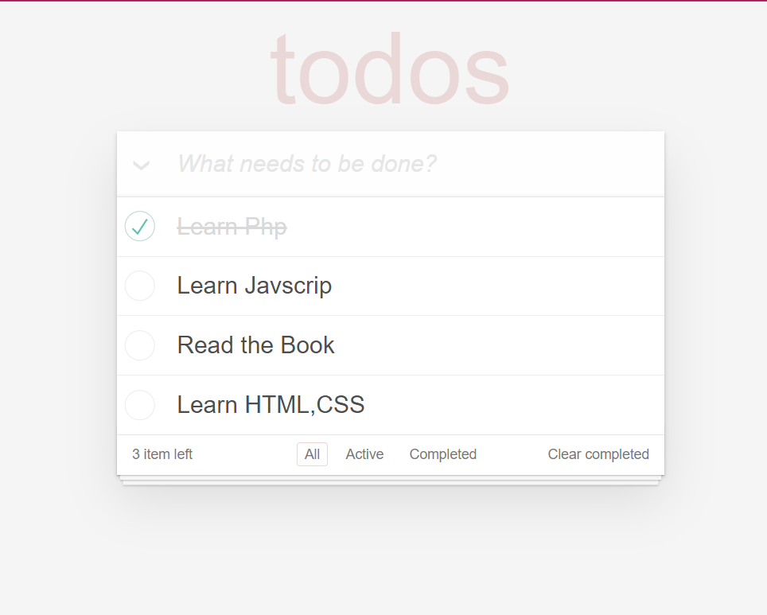

# Project ToDos

## Thông tin cá nhân
* Họ Tên : Đinh Văn Hoàng
* Email: dinhvanhoang472000@gmail.com

## Mô tả Project
Sử dụng ngôn ngữ Javascript và thư viện Jquery để xây dựng

## Các tính năng trong Project
*Có các tính năng cơ bản như :

+Hiển thị danh sách 

+Thêm công việc cần làm

+Sửa công việc

+Xóa công việc.

+Đánh dấu công việc đã hoàn thành 

+Đánh dấu tất cả công việc đã hoàn thành

+Xóa tất cả những công việc đã hoàn thành

+Đếm  số công việc chưa hoàn thành

+Lọc công việc như : tất cả,  đã hoàn thành, hưa hoàn thành  

+ Demo Giao diện :
+ 
           

 

##  Getting Set Up
1.this repository on Github.

2.Clone ' https://gitlab.com/trainee_123jobgroup/tts-11-2021/hoang_js_todo.git'
